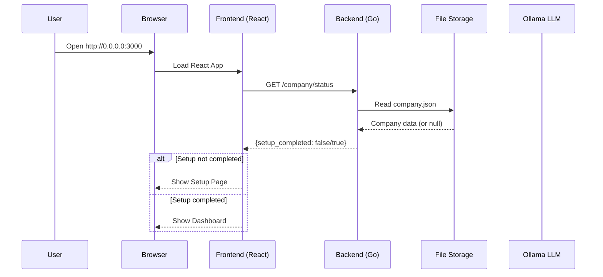
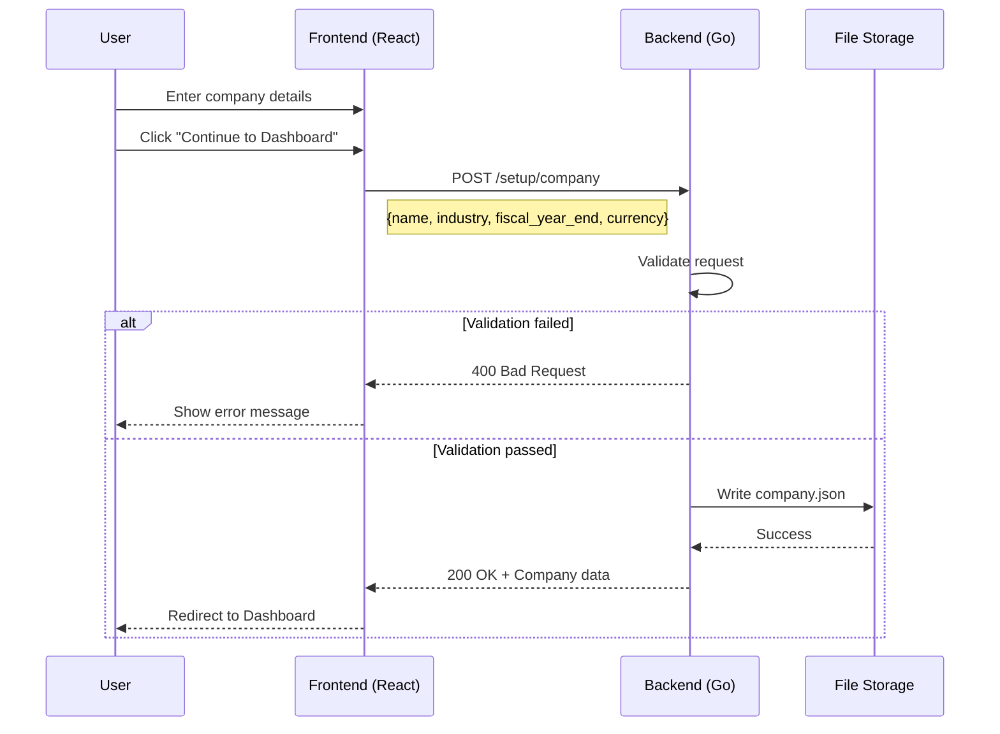
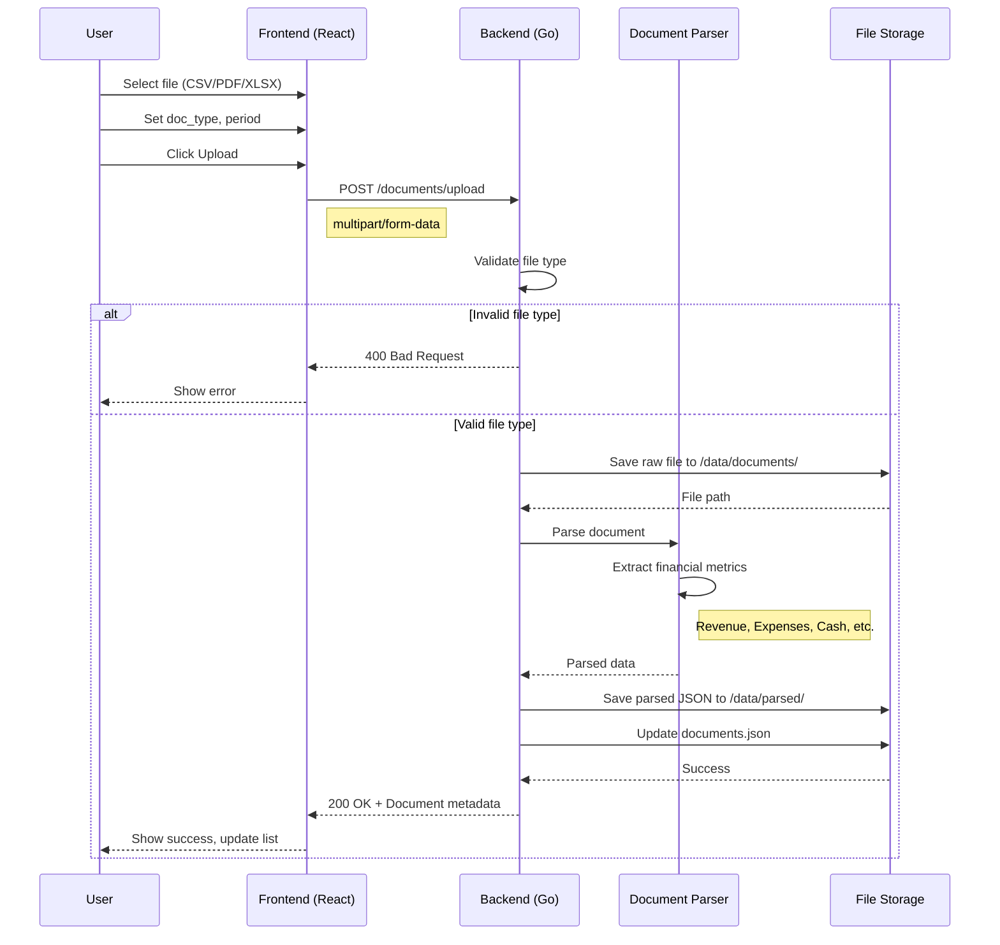
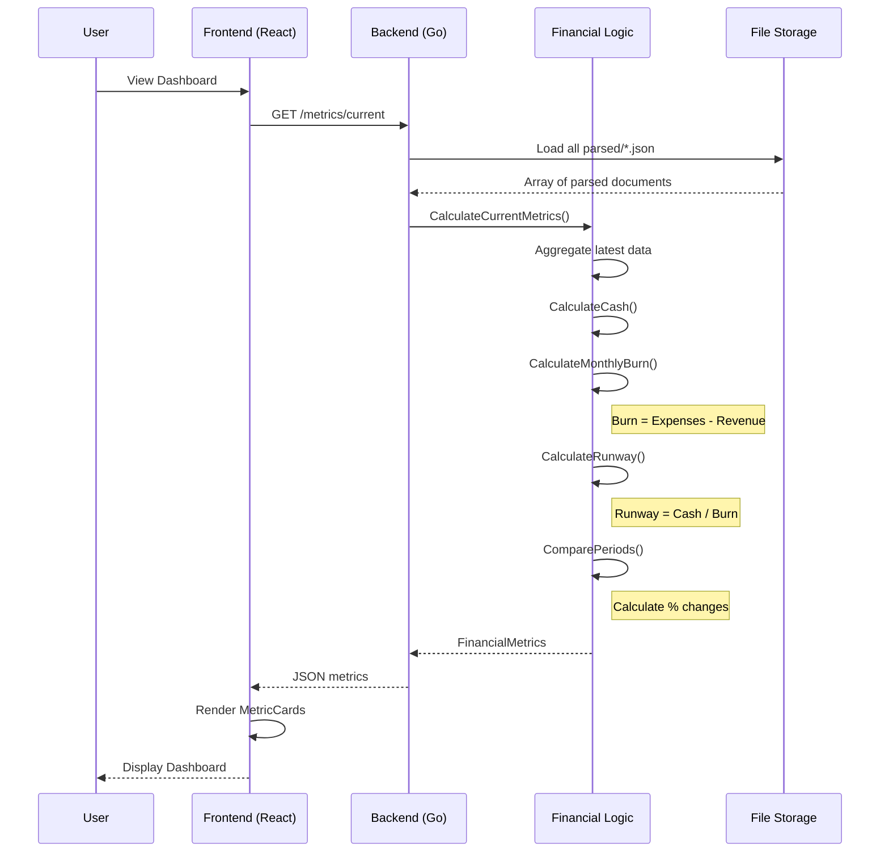
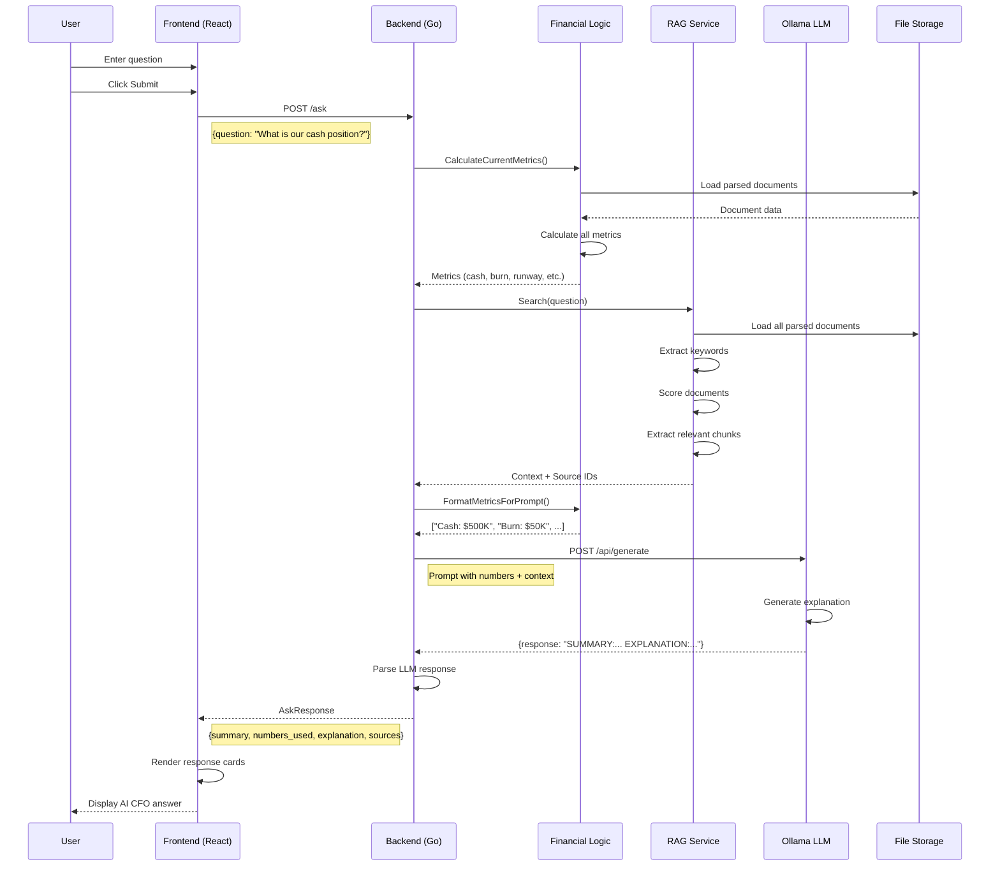
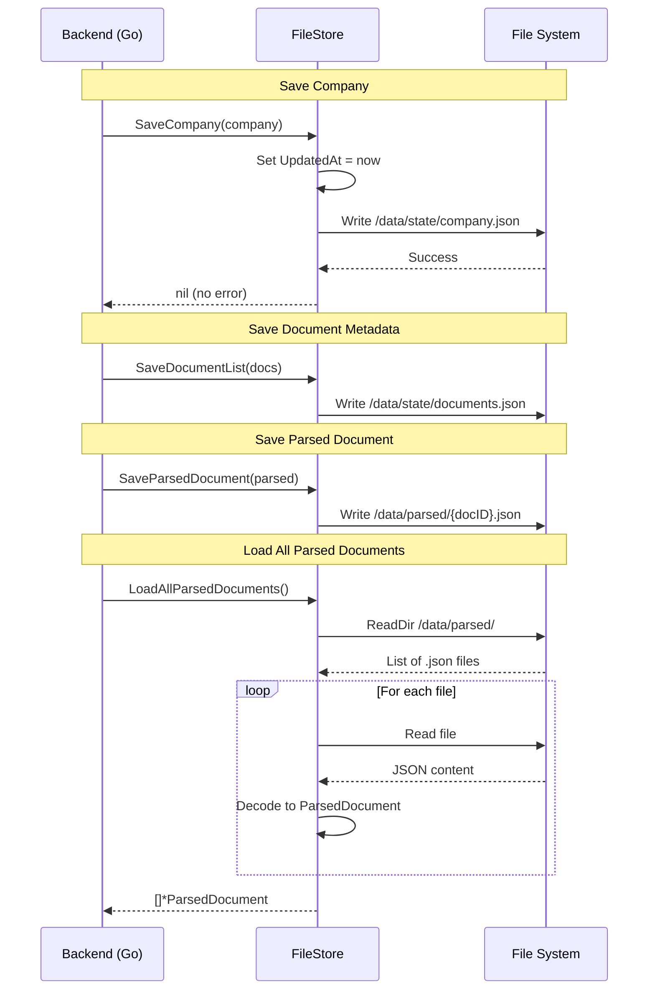
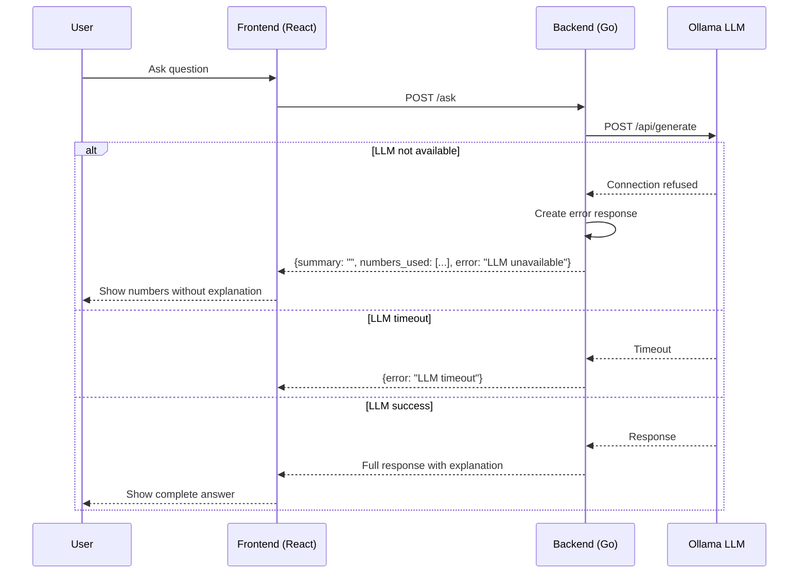
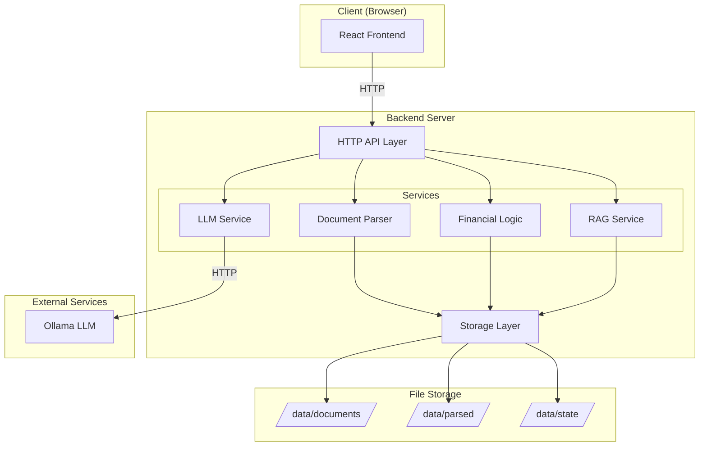
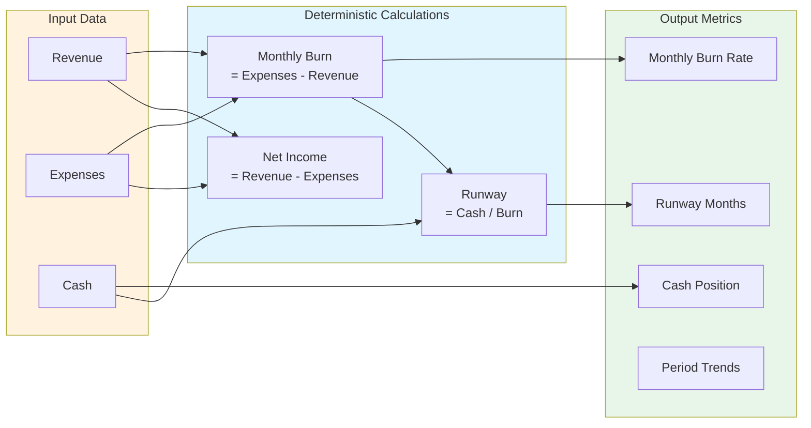
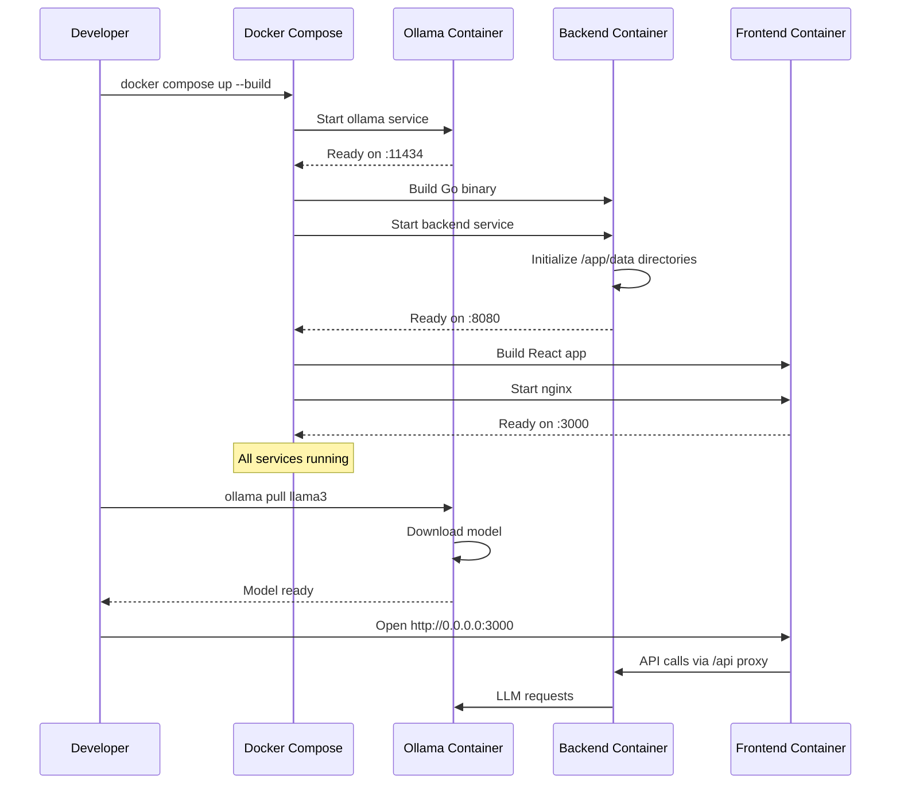

# AI CFO - Sequence Diagrams

Use these diagrams at https://sequencediagram.org or any Mermaid-compatible viewer.

---

## 1. Application Startup Flow



---

## 2. Company Setup Flow



---

## 3. Document Upload Flow



---

## 4. Dashboard Metrics Flow



---

## 5. Ask CFO Flow (Main Feature)



---

## 6. Data Persistence Flow



---

## 7. Error Handling Flow



---

## 8. Complete System Architecture



---

## 9. Financial Calculations Flow



---

## 10. Docker Deployment Flow



---

## Usage Instructions

### Option 1: SequenceDiagram.org
1. Go to https://sequencediagram.org
2. Copy the content between ```mermaid and ``` 
3. Paste and render

### Option 2: Mermaid Live Editor
1. Go to https://mermaid.live
2. Paste the Mermaid code
3. Export as PNG/SVG

### Option 3: VS Code
1. Install "Mermaid Preview" extension
2. Open this file
3. Preview renders automatically

### Option 4: GitHub/GitLab
- These diagrams render automatically in markdown files

